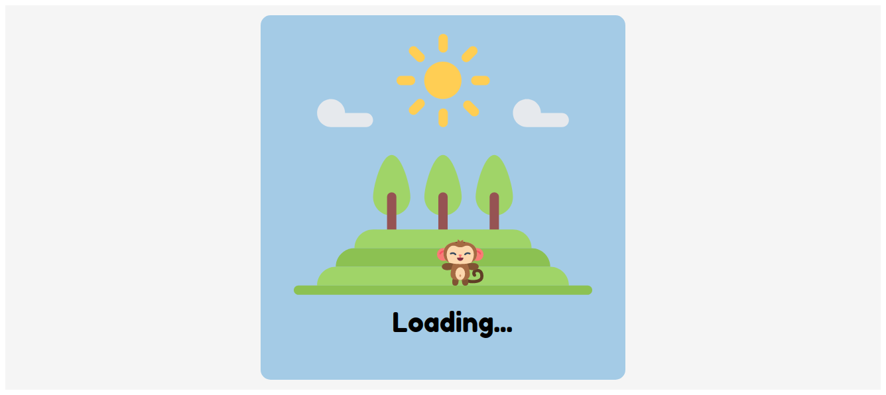

# Funny Idea for a Loading Page

> This is an original project that consists in a fun loading page, that is also a game that you can play while waiting. 

[Walkthrough Video](https://www.loom.com/share/810657bfa8eb477db87c4d0b39e94d01)

It is SVG and CSS animation based and uses Javascript to set up its interactiveness.

## Built With

- CSS, HTML and JavaScript

## Live Demo

[Live Demo Link](https://marilenaroque.github.io/LoadingPage-svg/)

## Author

👤 **Marilena Roque**

- Github: [MarilenaRoque](https://github.com/MarilenaRoque)
- Twitter: [@MariRoq88285995](https://twitter.com/MariRoq88285995)
- Linkedin: [roquemarilena](https://www.linkedin.com/in/roquemarilena/)

## 🤝 Contributing

Contributions, issues and feature requests are welcome!

Feel free to check the [issues page](issues/).

## Show your support

Give a ⭐️ if you like this project!

## Credits
SVGs Source: FlatIcon

